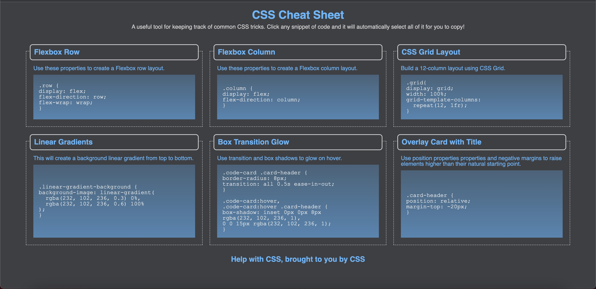

# css-cheat-sheet

## Description
This web page is designed to showcase CSS snippets while meeting the following criteria:

* As a user, I can view a collection of labeled CSS snippets in a responsive grid.

* As a user, I can easily identify these CSS snippets by their headings.

* As a user, I can highlight a code snippet by clicking on it.

* As a user, I can view my application on a mobile device as well as a desktop.

In service of meeting these requirements while having readable code, the website:

* uses semantic HTML elements and proper indentation

* uses CSS variables to maintain clean and reusable values for a color scheme

* uses flexbox and media queries to create a responsive grid layout

* has each snippet arranged in a card-like layout with the CSS syntax wrapped in an HTML pre element

* allows each CSS snippet to easily be highlighted for copying on click using the CSS user-select property

* incorporates a background color using a CSS linear-gradient function

* incorporates a bit of animation using the CSS transition property

## Installation
N/A

## Usage
This page can be viewed at: https://rykaplan1.github.io/css-cheat-sheet

## Credits
N/A

## License
N/A
